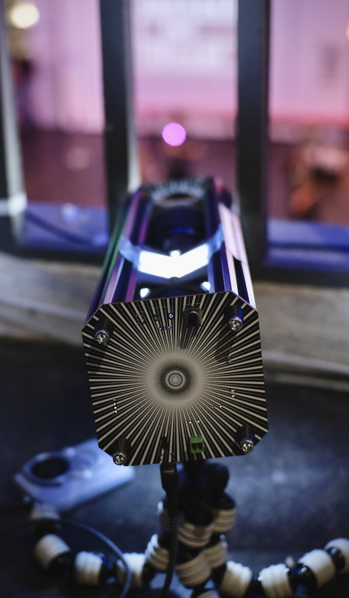

# ligra

ligra is an open source image projector build from scratch and based off of flea market parts. ligra is not neccessarily a PCB-project nor a single thing, but rather an idea of how to design your own image-projection system. It is an introduction on how to create light-grafittis, how to share messages at large.

It's not strictly a Gobo, rather a way of building a system that may resemble one, but may also resemble a video projector or an abstract source of art. I have mostly used it with 2D printed stencils, usually used with so called "overhead projectors", one can of course also use metal-stencils, coloured effect-foils, 3D printed stencils and even LCDs, or really anything that may project an image. Get creative! 

<table>
  <tbody>
    <tr>
      <td>
        
      </td>
      <td>
        
      </td>
    </tr>
  </tbody>
</table>

This repo is very WIP and shall be expanded soon :3

## Working principle

ligra essentially functions as a backwards camera, well, most projectors do. This becomes more visible when we talk about its inner workings, it's heart and most fixed element is the lens, a Canon FD lens in our case. But instead of using it to project and image **onto** a 35mm film slide, we will project light **through** a ruffly 35mm film slide-sized, image forming medium (i.e. a 2D printed stencil). This light will enter the lens from the back, projecting an image onto a scene with the properties of the lens (focal length, aperture and focus). Given the quality of even early lenses, we can expect some sharp and crisp projections. [WIP ...]

## [Instructions](https://github.com/Jana-Marie/ligra/blob/main/instructions.md)

(^ click me)

## [Projection-Media](https://github.com/Jana-Marie/ligra/blob/main/projection-media.md)

(^ click me)

## Todo

- [ ] Add assembly instructions
- [ ] Add 3D print instructions
- [ ] Add BOM
- [ ] Add drawings
- [ ] Cleanup OpenSCAD file
